# Openlane_Workshop_VSD
This repository will reflect the work done in the Advanced Physical Design Flow workshop, offered by the folks at VSD. It's a 5 day workshop that aims to educate us on the intricacies of Open Source EDA tools and PDKs as used by industry leaders. Furthermore, it uses Openlane flow to help understand the flow of work when it comes to VLSI designs, starting from the RTL level to the GSDII stage, performing the synthesis, placement, floorplanning, routing and sta required to do so.


# Day 1 - An Introduction to OpenLANE

Day 1 kickstarted off with educating us about "chips". Most of us have played around with an Arduino, as electronics enthusiasts and hobbyists, but we've only toyed around with the functionalities of the Arudino, not the brain of the processor itself. The very first lecture of this workshop opened our eyes to what exactly lies in front of us if we choose to this "VLSI" career road, a road that in recent times has been travelled by many. 

Macros, IPs, RISC-V and the software-to-hardware piepline were some of the topics hit upon.

$PDK_ROOT is the parent root directory under which we will find the Skywater PDK files that have been used. Access to 3 main sub-directories, namely, sky130A, skywater-pdk and open_pdks have been provided.

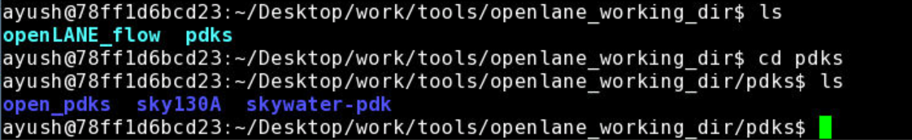

1. Skywater-pdk – Contains all the foundry provided PDK related files
2. Open_pdks – Contains scripts that are used to bridge the gap between closed-source and open-source PDK to EDA tool compatibility
3. Sky130A – The open-source compatible PDK files

Sky130A comes with 2 sub-directories - libs.ref & libs.tech. They can be accessed as follows:-


libs.ref - This contains the process specific files. The one we're concerned with is sky130_fd_sc_hd. This can be deconstructed as:-

1. sky130A - Process Name
2. fd - foundry name
3. sc - standard cell
4. hd - high density

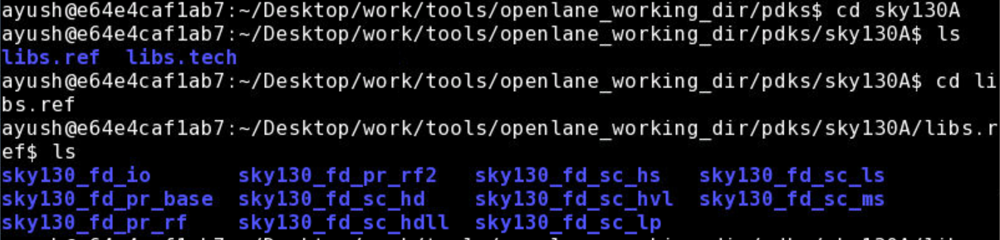


# Day 3 - #

... till plotting

rise time, fall time, propogation delay calculations

Magic's DRC Engine - 
documentation - opencircuitdesign.com/magic
online command summary - good handbook to have
technology files
drc why
cif see VIA2
drc check
tech load sky130A.tech


libs.tech - This contains files specific to the tools we'll be using for the purpose of end-to-end VLSI deisgn flow.

The tools included are - klayout, magic, netgen, ngspice, openflow, qflow

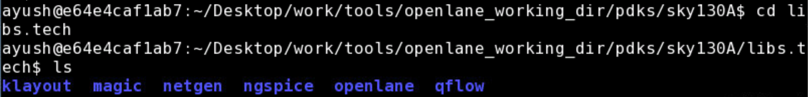


### Calling upon OpenLANE ###

The command used to run the OpenLANE flow is `./flow.tcl`

This command is explicitly run in the docker, which should be installed along with the OpenLANE tools, pdks and other files. 

To run OpenLANE interactively, `./flow.tcl -interactive` , should do the trick.

Furthermore, OpenLANE requires different software dependencies to run it, which is provided to it by running the command - package require openalane 0.9

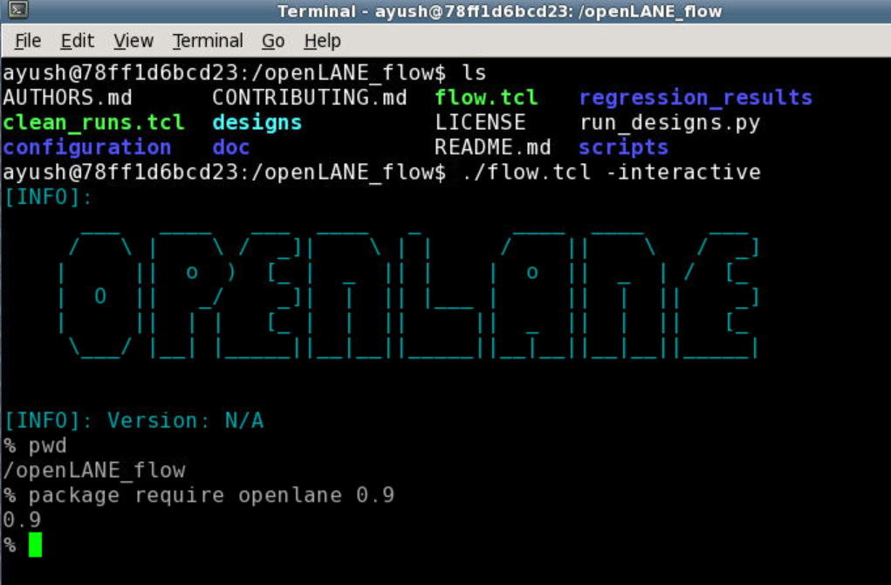

The Designs being run through OpenLANE flow are enlisted below, under the directory openLANE_flow/designs

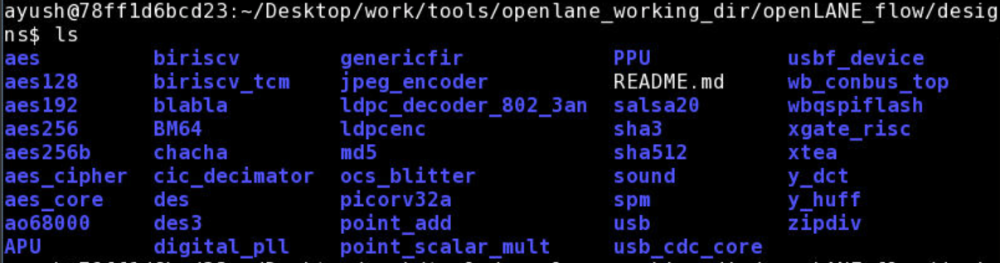

For the duration of this workshop, and for this repository, we will be focussing on the "picorv32a" design.
The design heirarchy for picorv32a is listed below

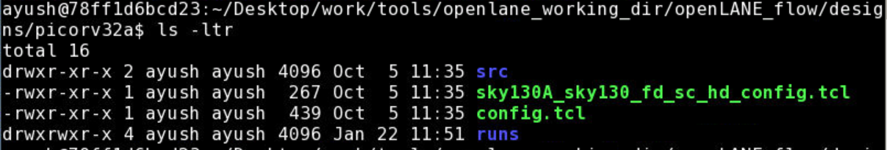

1. The "src" folder contains verilog and sdc files
2. The "config.tcl" file is responsible for containing the various design specific configuration switches and parameters as used by the OpenLANE flow tools.

### Preparing the Design ###

The Keyword "prep" is used for preparing the design so that it's ready to be used effectively by the OpenLANE tools.

The command to do this is : `prep -design <design_name> `
  
  In our case, design_name = picorv32a
  
This serves another important purpose, which is to merge the cell LEF and technology LEF information.

1.The cell LEF works towards providing the user with information about the standard cells, it's area, i/p-o/p terminals, different layers etc.

2.The Tech LEF files contains layer definitons and a set of restricted design rules

During this preparation stage of OpenLANE, the two LEF files are combined and are collectively termed as merge.LEF

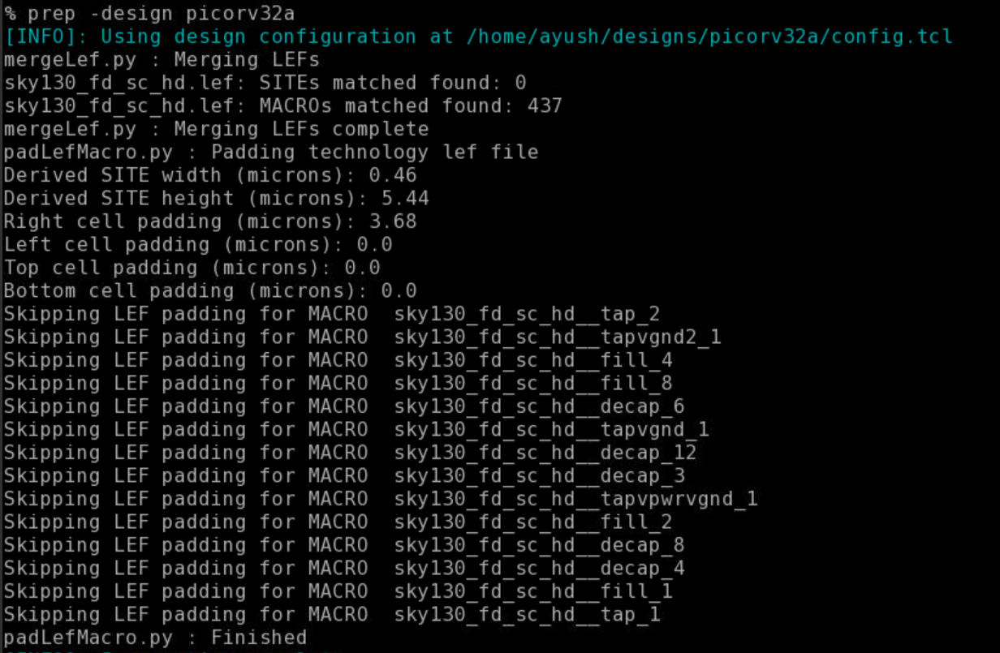

### Running Synthesis ###

OpenLANE provides a very simple way to run the synthesis of the design file, (here picorv32a.v), interactively.

The command to do so is `%run_synthesis`, which takes about 2-4 minutes to run.


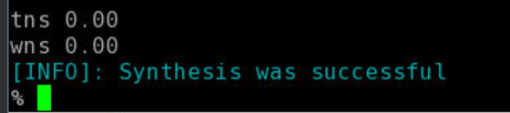

Here's a sneak peek into what your synthesis file picorv32a.synthesis.v (present in the designs/picorv32a/runs/<date_of_run>/results/synthesis folder) should look like

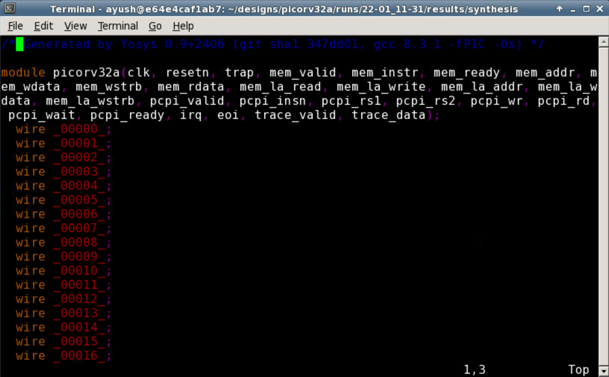

# Day 2 - Understanding Floorplanning and Standard Cells

The step foreshadowing the synthesis stage, is technically termed as "floorplanning". This tool works exactly how you'd manifest the thought of floorplanning on a chip would be like. It performs functions, not limited to:
1. Determining core and die area and dimensions, 
2. Standard cell rows for the placement of standard cells, 
3. Placement of necessary Macros, IPs etc.
4. Power Planning, (Although this step is not performed in OpenLANE's floorplanning, it is traditionally performed in the floorplanning stage).

Some floorplan controlled parameters include:
#### 1. Aspect Ratio & Utilization Factor 
Aspect Ratio is defined as the ratio of the height of the core to the width of the core. This number is elemental in helping us understand the shape of the core we're dealing with. 

Utilization Factor, intuitively, can be understood as a measure of how much area is being _utilized_ by the netlist prepared by the preceding stage of the VLSI design flow. It's mathematically defined as the ratio of area occupied by the netlist, to the total area of the core available. Sometimes expressed as a percentage, it is advisable to accept a factor ranging between 0.5 and 0.7 as this allows for better optimization in the routing phase and comes in handy when dealing with many additional features. 

#### 2. Preplaced Cells ####
Also coined the phase MACROs, they play an elemental role in the flow. Responsible for many a functionalities, they have set reserved spots which are blocked from ordinary cells during floorplanning.

#### 3. Decoupling Capacitors ####
Voltage drops associated with the interconnected wires often poses the problem of noise margins significantly affecting the state of the signal being passed on. If found hovering in no man's land, i.e, the portion between the digital states LOW and HIGH, a metastable/unstable state is achieved which affects the digital design overall. 
Decoupling Capacitors are analogous to reservoirs, in the sense that they store the charges necessary and deploy their resources as and when required, often during times when a transition from LOW-to-HIGH or HIGH-to-LOW is required. Acting as a primary source of charge, it eliminates the need for the power supply to do all the lifting. 

#### 4. Power Planning ####
Although one doesn't find OpenLANE looking into this issue during the floorplanning phase, it has been traditionally deployed to work it's way into the flow in this stage previously. Charge dumps to HIGH/LOW must happen efficiently in the event of a transition, negligence of which leads to accumulation of unwanted charges at the tap, forcing the ground line to behave as a large resistor, lowering the noise margin. One can only hope to lower this unavoidable resistance build up by introducing the necessary power straps.

### Additional Data Set-up features ###

The session started off with helping us understand the significance and application of the keywords _tag_ and _overwrite_

_tag_ is responsible for providing a convenient user defined name to the run we'll be executing. In my case, I've chosen to name the run "workshop" for the entire duration of the workshop.

This is implemented while preparing the design by executing this command :- `prep -design <design_name> -tag <tag_name> `

Here, design_name = picorv32a & tag_name = workshop

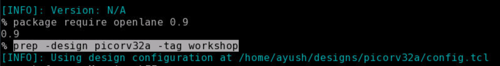

This reflects in the designs/picorv32a/runs folder as "workshop"

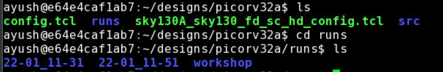

_overwrite_ is responsible for making & saving new changes in the configuration files (config.tcl) that are customized as per the user's convenience. However, this usually cleans everything preceding it, which is why there is emphasis laid on using the _set_ keyword for making changes.

`prep -design <design_name> -tag <tag_name> -overwrite` - used to overwrite new changes 

This is how one can use the _set_ keyword to make changes. Here it is demonstrated on the CLOCK_PERIOD variable.

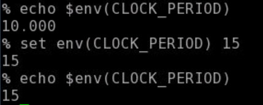


### Running the floorplan tool ###

Running floorplan in OpenLANE is fairly simple :- `%run_floorplan` in the docker. 

In compatability with the other stages in the physical design flow, floorplan will also run as per the configuration settings preset in the design config.tcl files.

Once floorplan is run, it produces a def file "picorv32a.floorplan.def", which provides us with information about core area, as well as placement of standardized cell SITES.

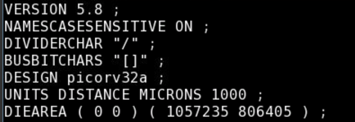

`UNITS DISTANCE MICRONS 1000;` indicates that there exists 1000 data units in the space of 1 Micron.

`DIEAREA (0 0) (1057235 806405)` indicates the placement of the die. The two coordinates described follow the `(lower_left_x, lower_left,y) (upper_right_x upper_right_y)` system.

### Viewing Floorplan in Magic ###

We have taken the help of the Magic VLSI tool for the purpose of viewing the results of our floorplan.

For doing so, we must provide 3 main files:

1. Magic Technology file (sky130A.tech)
2. Floorplan's generated def file - picorv32a.floorplan.def
3. Merged LEF file from the preparation stage - merged.lef (found in the <tag_name>/tmp directory)

Another important point to note is that to view a certain tool's result in magic, the command must be run in the _"<tag_name>/results/<tool_name>"_ directory.

The command to view the result in magic is as follows:-

`magic -T /Desktop/work/tools/openlane_working_dir/pdks/sky130A/libs.tech/magic/sky130A.tech lef read ../../tmp/merged.lef def read picorv32a.floorplan.def &`


This opens up Magic, and we can view the basic floorplan laid out as :-

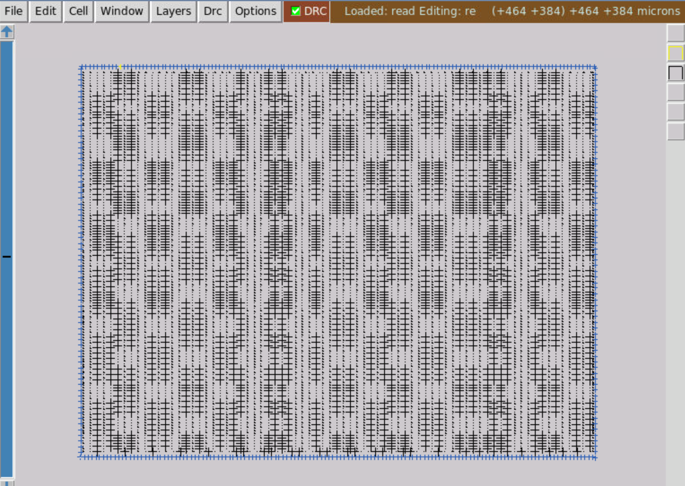

### Executing the PLacement ###

Following Floorplan, the next step in Physical Design flow is the Placement Stage. The synthesized netlist has been mapped to standard cells and floorplanning phase has determined the standard cells rows, enabling placement.

There are 2 stages to Placement as well:-
1. Global Placement - This optimizes but isn't legal placement. It works to reduce net wirelength by reducing HPWL (Half Perimeter Wire Length). HPWL is the length + width of any area given
2. Local Placement - This legalizes placement of cells into standard cell rows while adhering to global placement.

Once again, this is done so by the following command - `%run_placement`

This might take a while, as it iteratively performs it's optimizations as shown.

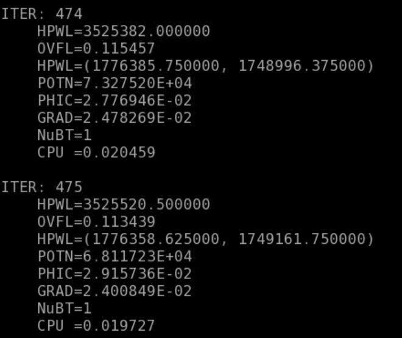

The end result provides the Evaluation and Legality checks - 

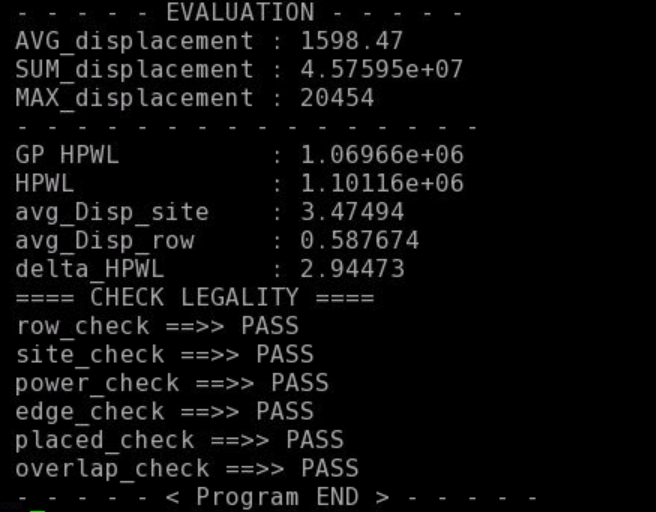

### Viewiwng Placement on Magic ###

We now wish to view the results of the placement done on Magic. 

The command to do so is similar to the one we used to view our floorplan, with a few changes.

`magic -T /Desktop/work/tools/openlane_working_dir/pdks/sky130A/libs.tech/magic/sky130A.tech lef read ../../tmp/merged.lef def read picorv32a.placement.def &` which is run in the _"<tag_name>/results/placement"_ directory.

The results of the placement on Magic is as follows:- 

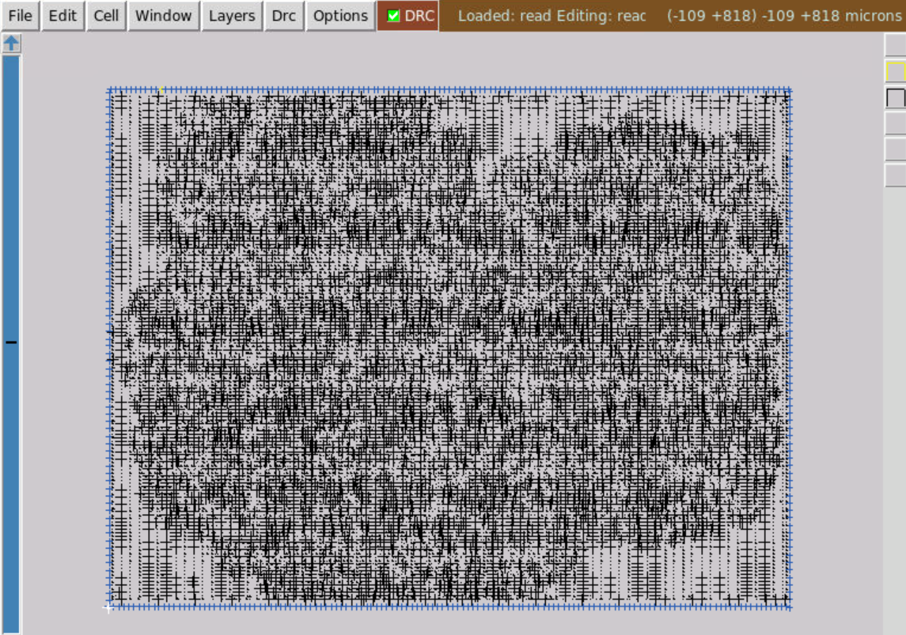 

Upon zooming in, we can view the following:-

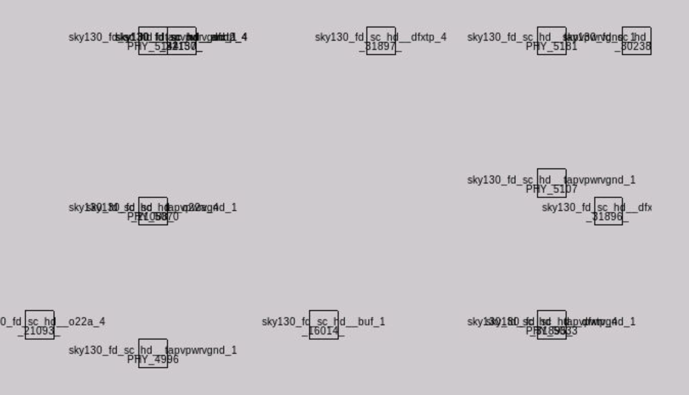 


#### Notes on Standard Cell characterization ####
Standard Cell Design Flow is old fashioned, in the sense that it works in 3 significant stages, Inputs-Design-Outputs. 
1. Inputs - PDK files
2. Design - Circuit and Layout Design, along with Standard Cell Characterization, performed by the software GUNA, which is open-sourced as well. 
3. Outputs - The Output files are typically Circuit Design Language (CDL) files, GDSII.

These cells need to be characterized by liberty files to be used by synthesis tools to determine optimal circuit arrangement. This is elemental and lays the structure to the process we know as Standard Cell Characterization.


# Day 3 - Analyzing the Standalone Standard Cell #

### Cloning the design file & Moving the tech file ###
The majority of work done on this day focussed on a simple CMOS inverter predesigned in magic. We explicitly worked on the .mag file for the inverter mentioned which was available in @nickson-jose's github repository titled "vsdstdcelldesign".

In the openlane_working_dir/openLANE_flow directory, clone the said repository using the command:

`git clone https://github.com/nickson-jose/vsdstdcelldesign`

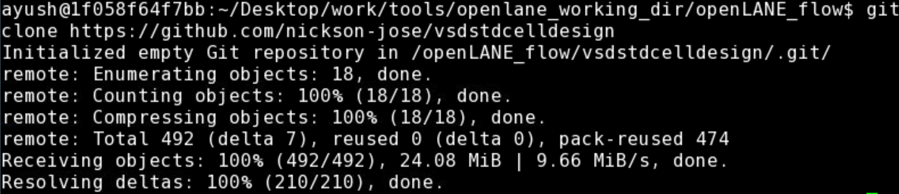

The .mag file we're concerned with is the sky130A_inv.mag file, which is shown here in the repo

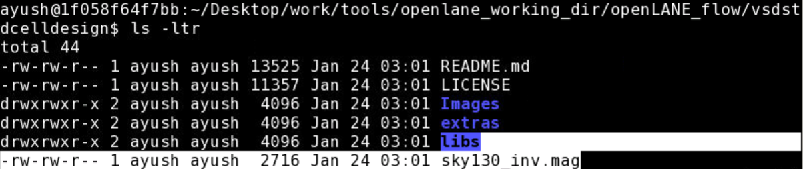

Since we'll be operating on this file in Magic, it makes it convenient for us to load the necessary tech file, (here sky130A.tech), which is present in the openlane_working_dir/pdks/sky130A/libs.tech/magic folder, onto the vsdstdcelldesign folder in openLANE_flow

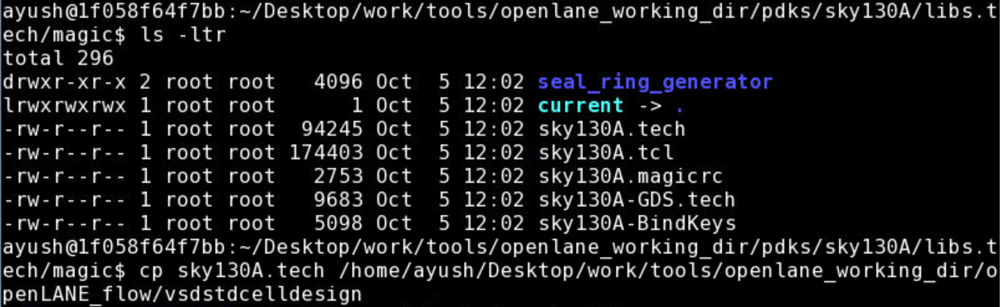

We do so by navigating to the required location which holds the sky130A.tech file and copying that to the openLANE_flow/vsdstdcelldesign directory.

`cp sky130A.tech /Desktop/work/tools/openlane_working_dir/openLANE_flow/vsdstdcelldesign`

Once this is done, we can navigate to the vsdstdcelldesign repo and find our tech file (sky130A.tech) file there
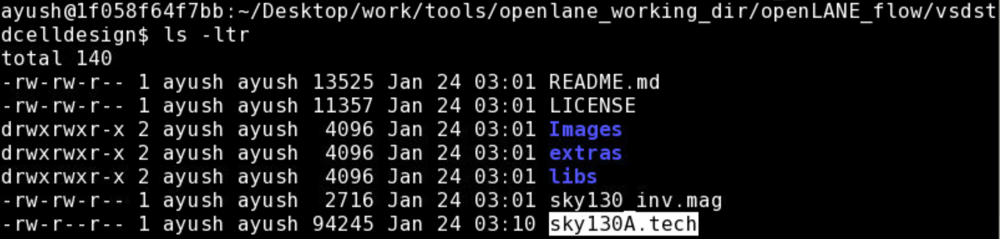

We can view the .mag design file (sky130A_inv.mag) in magic using the following command :-

`magic -T sky130A.tech sky130A_inv.mag &`

This opens up the design in magic as 
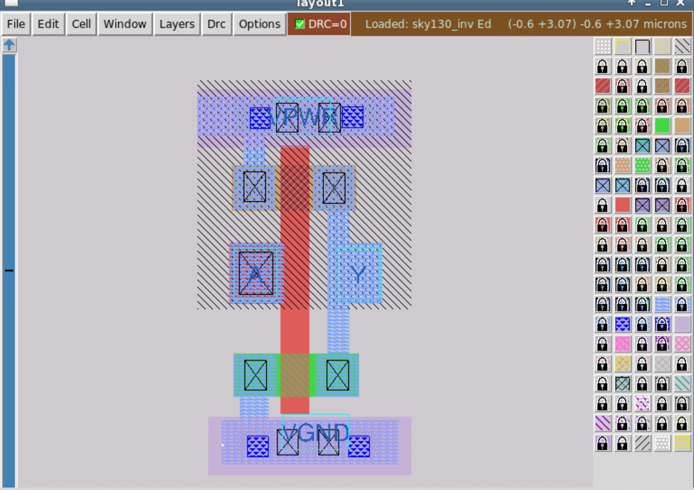

An important point to note here is the colour palette that is shown on the right side of the Magic tool. VLSI design is famous for multilayered approach to design, which isn't uncommom knowledge. The colour palette offers a wide variety of colours that are helpful when it comes to differentiating the different layers that certain components are a part of. Hovering over these components usually give an indication of the layer they're present on. 
### Getting Hands on with Magic ###

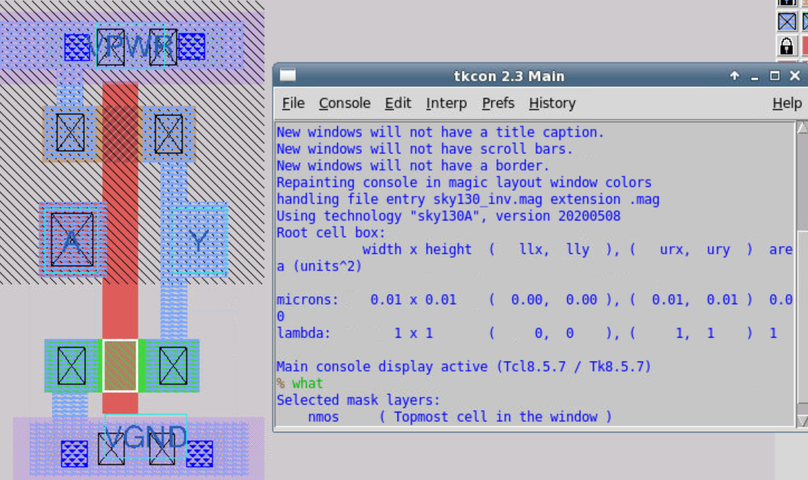 

As seen here, by merely hovering the cursor above a certain portion of the design, pressing s and entering the command `%what` in Magic's terminal, we get the description of the component of the design we're viewing.

In this case, we're seen hovering above what seems to be the nmos part of the inverter design.

### Extracting the Parasitic Spice File ###

To extract the parasitics, we've to create an extraction file (.ext)

We work on the Magic terminal for this purpose and enter the following commands, in order:-

``` 
% extract all
% ext2spice cthresh 0 rthresh 0
% ext2spice 
```

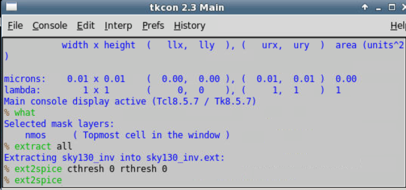

This reflects in the vsdstdcelldesign directory as well as shown:-

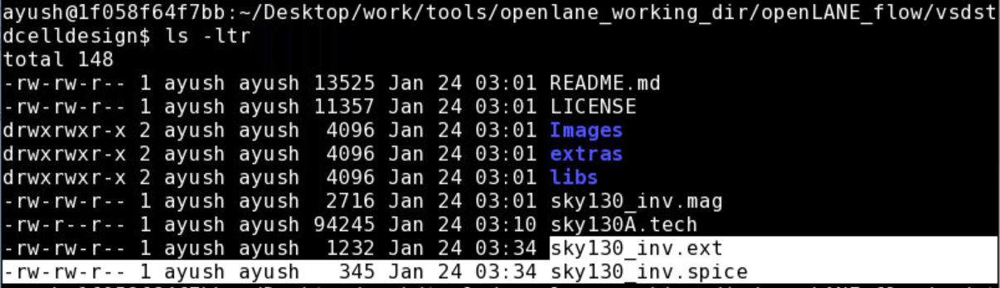

### Understanding the Design further using ngspice ###

Once we have the .spice file available in the directory, we can perform the necessary configurations and changes using an editor. 

There are some changes we need to make in the .spice file (sky130A_inv.spice) to prepare it for further stages of the OpenLANE flow.
They are:

1. include the pshort and nshort libraries - .include ./libs/phsort.lib & .include./libs/nshort.lib
2. pshort & nshort are replaced with pshort_model.0 and nshort_model.0 respectively.
3. We need to define some ports which we make use of in the design - VDD, VSS, Va.
4. Va A GND PULSE(0V 3.3V 0 0.1ns 0.1ns 2ns 4ns) - This implies a source Va, between A and GND, whose waveform is defined as a PULSE function with min value = 0V and max value = 3.3V
5. .tran 1n 20n - transient sweep from 1ns to 20 ns
6. .option scale=0.01u

These changes together should reflect in the spice file as follows:-

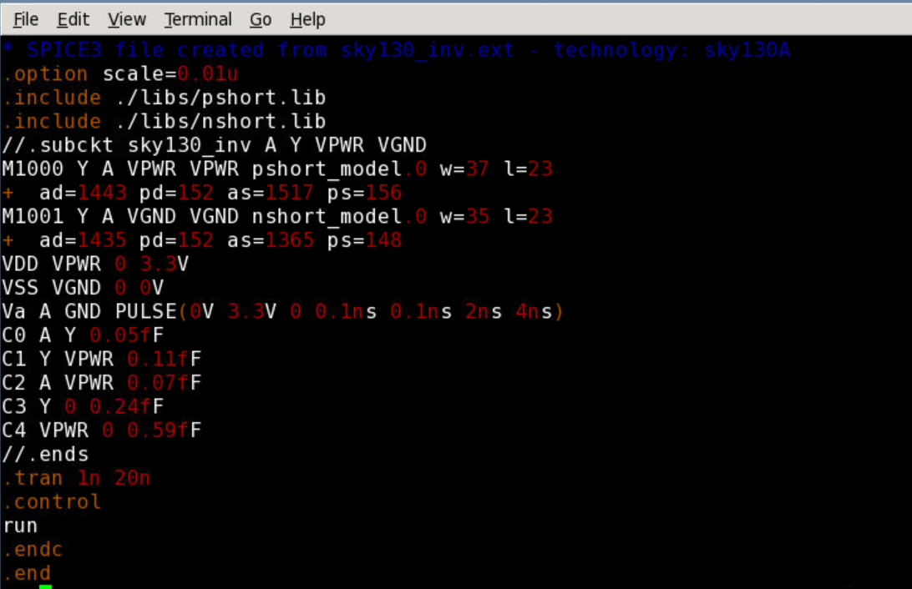

Once done, we can view the plot in ngspice by executing the command:-

`% plot y vs time a`

Which results in the following plot as shown:-

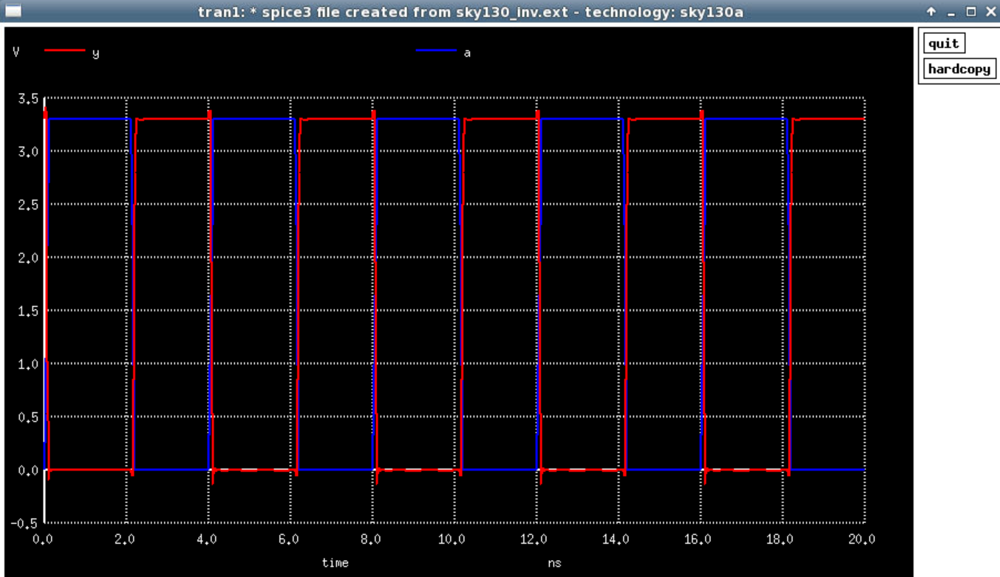

This plot will be used to compute the 3 parameters which intricately define the inverter designed in question. They are:-

1. Rise Time - This is defined as the time taken for the signal to go from 20% of it's max value to 80% of it's max value. We've defined the pulse to have a maximum magnitude of 3.3V. We find the 20% value to be 0.66V and the 80% value to be 2.64V. Experimentally it was found to be _rise_time_.
2. Fall Time - This is the exact opposite of rise time. It's the time taken for the signal to go from 80% of it's max value to 20%. It was found to be _fall_time_
3. Propogation Delay - This is defined as the time difference between the points where the input and output are at 50% of their magnitude.


