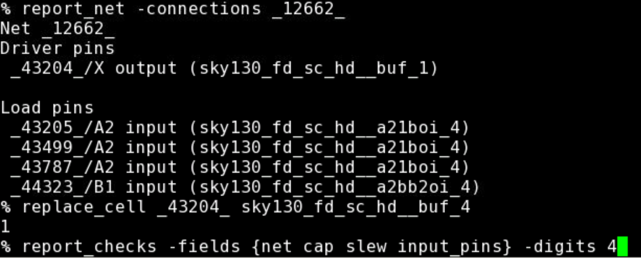

# Openlane_Workshop_VSD
This repository will reflect the work done in the Advanced Physical Design Flow workshop, offered by the folks at VSD. It's a 5 day workshop that aims to educate us on the intricacies of Open Source EDA tools and PDKs as used by industry leaders. Furthermore, it uses Openlane flow to help understand the flow of work when it comes to VLSI designs, starting from the RTL level to the GSDII stage, performing the synthesis, placement, floorplanning, routing and sta required to do so.

# Taking the First Steps # 

The beauty of open-source is that it's freely avaialable to everyone. OpenLANE is open-sourced as well, bringing us one step closer to using industry grade vlsi tools. To get OpenLANE up and running locally on your systems, it's essential to keep in mind 2 things:-

1. Ubuntu OS
2. 40GB+ Disk Space. (If you're comfortable with Virtual Box, you can make use of Partition GUIs to allocate the necessary memory)

Adding on, I would suggest anyone interested to go through these 2 courses, which were extremely helpful in guiding me through the entire installation and testing process. Both courses are freely avaialable on Udemy, offered by VSD.

[A complete guide to install OpenLANE and Sky130nm PDK](https://www.udemy.com/share/103wqAAEESeVZUR3QF/)

[A complete guide to install open-source EDA tools](https://www.udemy.com/share/101skKAEESeVZUR3QF/)

# Understanding the Flow #

ASIC (Application Specific Integrated Circuit) Design Flow is a dynamic process, which takes action through multiple stages. The flow is deconstructed into 11 different stages which are connected, and follow the heirarchy as shown in the figure below :- 


1. Chip Specification - VLSI engineers are provided with the "specs" that constrain their design for a certain system. These constraints, majorly physcial are elemental in determining the specifications.

2. Design Entry/Functional Verification - This stage is associated with RTL design and Behavioral Modeling that are performed by means of a Hardware Description Language (HDLs - Verilog, VHDL). These are the 2 main methods made use of when creating the HDL of a microarchitecture.

3. RTL synthesis - At this stage, an abstract specification of the desired behaviour is turned into a design implementation, represented by logic gates, typically performed by a synthesis tool. The HDL netlist is tech-mapped to the specific logic gates that give the design structure and shape. OpenLANE uses an Open-Source tool "yosys" to do so. 

4. Partitioning of Chip - Done in the RTL stage, this is responsible for demarcating certain sections of the chip and designing each sub-section.

5. DFT Insertion - DFT (Design for test) Circuit inserted.

6. Floorplanning - Responsible for not only planning the silicon core/die area according to the design, but is also tasked with it's ability to generate a Power Distribution Network throughout the chip, which is provided/tapped to each individual component of the synthesized netlist. Traditionally, PDN is performed in this stage, but the latest versions of OpenLANE don't include it in this tool. 

7. Placement Stage - This is responsible for the placement of the standard cells along the set rows and tracks, aligning itself with sites defined in the LEF files generated after synthesis. Split into 2 stages itself : i) Global and ii) Local Placement respectively which compound on each other to provide us with a more concrete structure to our design. 

8. Clock Tree Synthesis - This stage works towards building a clock distribution network that is tasked with delivering the clock to all associated sequential elements of the design. Optimization of the slack values is eminent to this stage. 

9. Routing - Performed after the CTS and PDN stages, it implements the interconnect system between standard cells in the design/netlist, and works towards minimizing DRC errors. 

10. Final Verification - Once the entire flow is setup, we perform one final verification to make sure there are no violations present that pose a problem to the chip.

11. GDSII - Graphic Design System, is a document that enlists the layout design of the chip in question, and is the file that is often talked about when the topic of IPs come up. It comes in the binary format, which is readable by specific EDA tools. 

# The OpenLANE flow #


Given above is the diagram that best describes the flow of work that takes place in OpenLANE. 

Provided to OpenLANE are 2 main inputs, the design file (.v format) and the PDK (labelled "SW PDK"), which in our case is the Skywater 130A PDK.

The design file goes through a synthesis stage employing the tools, yosys and abc. STA is performed at the closure of each sub stage to make sure there are no timing violations that pile up towards the end. This stage is followed by the entry of OpenROAD which takes care of Floorplanning, Placement, CTS & PDN. We then proceed to fix any slack violations that may be present in the design, one method to do so being the insertion of Ant. Diodes and Upsizing the necessary buffers to optimise the fanout and net-capacitance. Once done, we shift our focus to Routing, which is the final step in this flow, performed by TritonRoute. The tail end of the flow focusses on the finishing touches, i.e, extracting SPEF Files, physical verification and finally generating the GDSii file. 

# Day 1 - An Introduction to OpenLANE

Day 1 kickstarted off with educating us about "chips". Most of us have played around with an Arduino, as electronics enthusiasts and hobbyists, but we've only toyed around with the functionalities of the Arudino, not the brain of the processor itself. The very first lecture of this workshop opened our eyes to what exactly lies in front of us if we choose to this "VLSI" career road, a road that in recent times has been travelled by many. 

Macros, IPs, RISC-V and the software-to-hardware piepline were some of the topics hit upon.

$PDK_ROOT is the parent root directory under which we will find the Skywater PDK files that have been used. Access to 3 main sub-directories, namely, sky130A, skywater-pdk and open_pdks have been provided.


1. Skywater-pdk – Contains all the foundry provided PDK related files
2. Open_pdks – Contains scripts that are used to bridge the gap between closed-source and open-source PDK to EDA tool compatibility
3. Sky130A – The open-source compatible PDK files

Sky130A comes with 2 sub-directories - libs.ref & libs.tech. They can be accessed as follows:-


libs.ref - This contains the process specific files. The one we're concerned with is sky130_fd_sc_hd. This can be deconstructed as:-

1. sky130A - Process Name
2. fd - foundry name
3. sc - standard cell
4. hd - high density


libs.tech - This contains files specific to the tools we'll be using for the purpose of end-to-end VLSI deisgn flow.

The tools included are - klayout, magic, netgen, ngspice, openflow, qflow


### Calling upon OpenLANE ###

The command used to run the OpenLANE flow is `./flow.tcl`

This command is explicitly run in the docker, which should be installed along with the OpenLANE tools, pdks and other files. 

To run OpenLANE interactively, `./flow.tcl -interactive` , should do the trick.

Furthermore, OpenLANE requires different software dependencies to run it, which is provided to it by running the command - package require openalane 0.9


The Designs being run through OpenLANE flow are enlisted below, under the directory openLANE_flow/designs


For the duration of this workshop, and for this repository, we will be focussing on the "picorv32a" design.
The design heirarchy for picorv32a is listed below


1. The "src" folder contains verilog and sdc files
2. The "config.tcl" file is responsible for containing the various design specific configuration switches and parameters as used by the OpenLANE flow tools.

### Preparing the Design ###

The Keyword "prep" is used for preparing the design so that it's ready to be used effectively by the OpenLANE tools.

The command to do this is : `prep -design <design_name> `
  
  In our case, design_name = picorv32a
  
This serves another important purpose, which is to merge the cell LEF and technology LEF information.

1.The cell LEF works towards providing the user with information about the standard cells, it's area, i/p-o/p terminals, different layers etc.

2.The Tech LEF files contains layer definitons and a set of restricted design rules

During this preparation stage of OpenLANE, the two LEF files are combined and are collectively termed as merge.LEF


### Running Synthesis ###

OpenLANE provides a very simple way to run the synthesis of the design file, (here picorv32a.v), interactively.

The command to do so is `%run_synthesis`, which takes about 2-4 minutes to run.


Here's a sneak peek into what your synthesis file picorv32a.synthesis.v (present in the designs/picorv32a/runs/<date_of_run>/results/synthesis folder) should look like


# Day 2 - Understanding Floorplanning and Standard Cells

The step foreshadowing the synthesis stage, is technically termed as "floorplanning". This tool works exactly how you'd manifest the thought of floorplanning on a chip would be like. It performs functions, not limited to:
1. Determining core and die area and dimensions, 
2. Standard cell rows for the placement of standard cells, 
3. Placement of necessary Macros, IPs etc.
4. Power Planning, (Although this step is not performed in OpenLANE's floorplanning, it is traditionally performed in the floorplanning stage).

Some floorplan controlled parameters include:
#### 1. Aspect Ratio & Utilization Factor 
Aspect Ratio is defined as the ratio of the height of the core to the width of the core. This number is elemental in helping us understand the shape of the core we're dealing with. 

Utilization Factor, intuitively, can be understood as a measure of how much area is being _utilized_ by the netlist prepared by the preceding stage of the VLSI design flow. It's mathematically defined as the ratio of area occupied by the netlist, to the total area of the core available. Sometimes expressed as a percentage, it is advisable to accept a factor ranging between 0.5 and 0.7 as this allows for better optimization in the routing phase and comes in handy when dealing with many additional features. 

#### 2. Preplaced Cells ####
Also coined the phase MACROs, they play an elemental role in the flow. Responsible for many a functionalities, they have set reserved spots which are blocked from ordinary cells during floorplanning.

#### 3. Decoupling Capacitors ####
Voltage drops associated with the interconnected wires often poses the problem of noise margins significantly affecting the state of the signal being passed on. If found hovering in no man's land, i.e, the portion between the digital states LOW and HIGH, a metastable/unstable state is achieved which affects the digital design overall. 
Decoupling Capacitors are analogous to reservoirs, in the sense that they store the charges necessary and deploy their resources as and when required, often during times when a transition from LOW-to-HIGH or HIGH-to-LOW is required. Acting as a primary source of charge, it eliminates the need for the power supply to do all the lifting. 

#### 4. Power Planning ####
Although one doesn't find OpenLANE looking into this issue during the floorplanning phase, it has been traditionally deployed to work it's way into the flow in this stage previously. Charge dumps to HIGH/LOW must happen efficiently in the event of a transition, negligence of which leads to accumulation of unwanted charges at the tap, forcing the ground line to behave as a large resistor, lowering the noise margin. One can only hope to lower this unavoidable resistance build up by introducing the necessary power straps.

### Additional Data Set-up features ###

The session started off with helping us understand the significance and application of the keywords _tag_ and _overwrite_

_tag_ is responsible for providing a convenient user defined name to the run we'll be executing. In my case, I've chosen to name the run "workshop" for the entire duration of the workshop.

This is implemented while preparing the design by executing this command :- `prep -design <design_name> -tag <tag_name> `

Here, design_name = picorv32a & tag_name = workshop


This reflects in the designs/picorv32a/runs folder as "workshop"


_overwrite_ is responsible for making & saving new changes in the configuration files (config.tcl) that are customized as per the user's convenience. However, this usually cleans everything preceding it, which is why there is emphasis laid on using the _set_ keyword for making changes.

`prep -design <design_name> -tag <tag_name> -overwrite` - used to overwrite new changes 

This is how one can use the _set_ keyword to make changes. Here it is demonstrated on the CLOCK_PERIOD variable.


### Running the floorplan tool ###

Running floorplan in OpenLANE is fairly simple :- `%run_floorplan` in the docker. 

In compatability with the other stages in the physical design flow, floorplan will also run as per the configuration settings preset in the design config.tcl files.

Once floorplan is run, it produces a def file "picorv32a.floorplan.def", which provides us with information about core area, as well as placement of standardized cell SITES.


`UNITS DISTANCE MICRONS 1000;` indicates that there exists 1000 data units in the space of 1 Micron.

`DIEAREA (0 0) (1057235 806405)` indicates the placement of the die. The two coordinates described follow the `(lower_left_x, lower_left,y) (upper_right_x upper_right_y)` system.

### Viewing Floorplan in Magic ###

We have taken the help of the Magic VLSI tool for the purpose of viewing the results of our floorplan.

For doing so, we must provide 3 main files:

1. Magic Technology file (sky130A.tech)
2. Floorplan's generated def file - picorv32a.floorplan.def
3. Merged LEF file from the preparation stage - merged.lef (found in the <tag_name>/tmp directory)

Another important point to note is that to view a certain tool's result in magic, the command must be run in the _"<tag_name>/results/<tool_name>"_ directory.

The command to view the result in magic is as follows:-

`magic -T /Desktop/work/tools/openlane_working_dir/pdks/sky130A/libs.tech/magic/sky130A.tech lef read ../../tmp/merged.lef def read picorv32a.floorplan.def &`


This opens up Magic, and we can view the basic floorplan laid out as :-


### Executing the PLacement ###

Following Floorplan, the next step in Physical Design flow is the Placement Stage. The synthesized netlist has been mapped to standard cells and floorplanning phase has determined the standard cells rows, enabling placement.

There are 2 stages to Placement as well:-
1. Global Placement - This optimizes but isn't legal placement. It works to reduce net wirelength by reducing HPWL (Half Perimeter Wire Length). HPWL is the length + width of any area given
2. Local Placement - This legalizes placement of cells into standard cell rows while adhering to global placement.

Once again, this is done so by the following command - `%run_placement`

This might take a while, as it iteratively performs it's optimizations as shown.


The end result provides the Evaluation and Legality checks - 


### Viewiwng Placement on Magic ###

We now wish to view the results of the placement done on Magic. 

The command to do so is similar to the one we used to view our floorplan, with a few changes.

`magic -T /Desktop/work/tools/openlane_working_dir/pdks/sky130A/libs.tech/magic/sky130A.tech lef read ../../tmp/merged.lef def read picorv32a.placement.def &` which is run in the _"<tag_name>/results/placement"_ directory.

The results of the placement on Magic is as follows:- 

 

Upon zooming in, we can view the following:-

 


#### Notes on Standard Cell characterization ####
Standard Cell Design Flow is old fashioned, in the sense that it works in 3 significant stages, Inputs-Design-Outputs. 
1. Inputs - PDK files
2. Design - Circuit and Layout Design, along with Standard Cell Characterization, performed by the software GUNA, which is open-sourced as well. 
3. Outputs - The Output files are typically Circuit Design Language (CDL) files, GDSII.

These cells need to be characterized by liberty files to be used by synthesis tools to determine optimal circuit arrangement. This is elemental and lays the structure to the process we know as Standard Cell Characterization.


# Day 3 - Analyzing the Standalone Standard Cell #

### Cloning the design file & Moving the tech file ###
The majority of work done on this day focussed on a simple CMOS inverter predesigned in magic. We explicitly worked on the .mag file for the inverter mentioned which was available in @nickson-jose's github repository titled "vsdstdcelldesign".

In the openlane_working_dir/openLANE_flow directory, clone the said repository using the command:

`git clone https://github.com/nickson-jose/vsdstdcelldesign`


The .mag file we're concerned with is the sky130A_inv.mag file, which is shown here in the repo


Since we'll be operating on this file in Magic, it makes it convenient for us to load the necessary tech file, (here sky130A.tech), which is present in the openlane_working_dir/pdks/sky130A/libs.tech/magic folder, onto the vsdstdcelldesign folder in openLANE_flow


We do so by navigating to the required location which holds the sky130A.tech file and copying that to the openLANE_flow/vsdstdcelldesign directory.

`cp sky130A.tech /Desktop/work/tools/openlane_working_dir/openLANE_flow/vsdstdcelldesign`

Once this is done, we can navigate to the vsdstdcelldesign repo and find our tech file (sky130A.tech) file there


We can view the .mag design file (sky130A_inv.mag) in magic using the following command :-

`magic -T sky130A.tech sky130A_inv.mag &`

This opens up the design in magic as 


An important point to note here is the colour palette that is shown on the right side of the Magic tool. VLSI design is famous for multilayered approach to design, which isn't uncommom knowledge. The colour palette offers a wide variety of colours that are helpful when it comes to differentiating the different layers that certain components are a part of. Hovering over these components usually give an indication of the layer they're present on. 
### Getting Hands on with Magic ###

 

As seen here, by merely hovering the cursor above a certain portion of the design, pressing s and entering the command `%what` in Magic's terminal, we get the description of the component of the design we're viewing.

In this case, we're seen hovering above what seems to be the nmos part of the inverter design.

### Extracting the Parasitic Spice File ###

To extract the parasitics, we've to create an extraction file (.ext)

We work on the Magic terminal for this purpose and enter the following commands, in order:-

``` 
% extract all
% ext2spice cthresh 0 rthresh 0
% ext2spice 
```


This reflects in the vsdstdcelldesign directory as well as shown:-


### Understanding the Design further using ngspice ###

Once we have the .spice file available in the directory, we can perform the necessary configurations and changes using an editor. 

There are some changes we need to make in the .spice file (sky130A_inv.spice) to prepare it for further stages of the OpenLANE flow.
They are:

1. include the pshort and nshort libraries - .include ./libs/phsort.lib & .include./libs/nshort.lib
2. pshort & nshort are replaced with pshort_model.0 and nshort_model.0 respectively.
3. We need to define some ports which we make use of in the design - VDD, VSS, Va.
4. Va A GND PULSE(0V 3.3V 0 0.1ns 0.1ns 2ns 4ns) - This implies a source Va, between A and GND, whose waveform is defined as a PULSE function with min value = 0V and max value = 3.3V
5. .tran 1n 20n - transient sweep from 1ns to 20 ns
6. .option scale=0.01u

These changes together should reflect in the spice file as follows:-


Once done, we can view the plot in ngspice by executing the command:-

`% plot y vs time a`

Which results in the following plot as shown:-


### Characterization of the Cell ###

This plot will be used to compute the 3 parameters which intricately define the inverter designed in question, this is called characterization of the cell. They are:-

1. Rise Time - This is defined as the time taken for the signal to go from 20% of it's max value to 80% of it's max value. We've defined the pulse to have a maximum magnitude of 3.3V. We find the 20% value to be 0.66V and the 80% value to be 2.64V. Experimentally it was found to be _0.04238 ns_.


2. Fall Time - This is the exact opposite of rise time. It's the time taken for the signal to go from 80% of it's max value to 20%. It was found to be _0.0278 ns_


3. Propogation Delay - This is defined as the time difference between the points where the input and output are at 50% of their magnitude. It's experimentally found to be _0.03357 ns_


# Day 4 - Pre-Layout Timing Analysis and Clock Tree Synthesis #

We now enter the realm of Placement and Routing, with emphasis laid on Clock Tree Synthesis and Setup and Hold slack violations.

The PnR tools, make use of abstract LEF files, to perform interconnect optimised routes, in accordance with the set guidelines which have governed the industry since it's inception.

Some of the guidelines are as mentioned. It is said that the input and output Ports, should be designed in such a way that they occupy odd multiples of the set track values, presented in the LEF files. As shown in the image below, this tabular representation indicates the x and y offsets and pitch defined for each layer of the design. The Offset is exactly half the pitch, which indicates the tracks are centred about the origin.


This can be adhered to on the magic terminal itself by writing the following command:-

`% grid 0.46um 0.34um 0.23um 0.17um`

Up next, we demonstrate how to define a PORT in magic. These ports can be Input/Output/VDD/GND depending upon the nature of the component and design. We use the GUI offered by Magic to do this. Upon clicing `Edit->Text`, One can find an interface open up which allows for enabling of a certain part of the design to become a port, whose number is customized by the user themselves.


The ports are defined on the terminal as follows :-

```
% port class inout 
% port use power // for VPWR

% port class input
% port use signal // for A

% port class output
% port use signal // for Y

% port class inout
% port use ground // for VGND
```

### LEF Generation in Magic ###

Magic, the tool, allows for users to create their Cell LEF files from the comfort of it's own terminal itself. This is done simply by executing the command `lef write` in the terminal. This returns a scale value of 0.01.

One can exit Magic now and view the .lef file in the directory concerned using any editor. This shows the initialization of the pins as ports as defined by the user before-hand. 


### Including Standalone Standardized Cells into OpenLANE ###
We now look to inculcate the standard cell (inverter) we'd worked on previously into the picorv32a design we're working on. 

To do so, we open the config.tcl file and make a few changes:
1. Add a few libraries and link them to their respective directories, significance of which will become clearer in further steps.
2. Adding a line to integrate the .lef files we've generated for the custom cell. 

Here's how the config.tcl file looks finally :-


The 3 libraries we're concerned with are listed below :-
1. fast.lib
2. slow.lib
3. typical.lib

Next, we need to prepare the design again in OpenLANE, following the standard steps of `./flow.tcl -interactive` -> `package require openlane 0.9`.

Once done, run `prep -design <design_name> -tag <tag_name> -overwrite`

"-overwrite" is significant as it overwrites the new changes made in the configuration files.

After the design is prepared, we run the following commands to include the additional lef files in the flow:

```
set lefs [glob $::env(DESIGN_DIR)/src/*.lef]
  
add_lefs -src $lefs
```

You can now open up the design on magic and you'll be able to find the sky130_vsdinv inverter upon zooming into the big picture, as shown :-


### Fixing Slack Violations ###

Upon running synthesis, it is seen that the setup and hold slacks are both in the negative spectrum. This indicates a VIOLATION! 

This is to be resolved before moving onto the next step. 

We run the "sta" open source tool to get a better understanding of the situation. 

Running `sta sta.conf` gives a table of data that communicates the necessary information regarding the delays and skews respectively for various pins. It also provides information about the fanout at each terminal, and upon executing `report_net -connections <net_number>` one can get a clearer idea about what other connections that net has.

#### Upsizing the Buffers ####

As shown, below, net number _12662_ is run by sky130_fd_sc_hc__buf1 when it actually branches out to 4 different pins, which is one reason we recognize this could be a location we can modify to improve the slack. 


It is observed that the large fanout for many nets leads to an increased value of capacitance, coupled with the fact that many of these nets ave been assigned buffers that aren't powerful enough to cater to the needs of all the components it fans out to. This is leading to unprecedented values of both HOLD and SETUP slack violations. The most commonly assigned buffer seems to be "sky130_fd_sc_hd__buf1", which when for selective nets has been changed to either "sky130_fd_sc_hd__buf4" or "sky130_fd_sc_hc__buf8" has solved a good chunk of the slack violation, previously prominent. Granted, it's not going to 100% solve the issue, but it's a step forward in the right direction. 

To give some perspective, changing just one specific net from buf1 -> buf4 improved my setup slack from -5.56 to -1.15. The key is to identiy those nets which are privy to high fanouts and susceptible to high capacitance values, and targetting them appropriately. 

This modification can be done as follows:- `replace_cell _<net_number>_ <name_of_buffer>` which implies the usage of a better buffer system to better handle the fanout and capacitance at that point.

Furthermore, the command `report_checks -fields {net cap slew input_pins} -digits 4` can be executed to view the table after the changes are made.
This process is known as upsizing the buffer, which helps in reducing the slack violation.

One can modify the env-based variables such as SYNTH_SIZING, SYNTH_BUFFERING, SYNTH_STRATEGY, by initializing them to "1" and updating SYNTH_DRIVING_CELL to sky130_fd_sc_hc__inv_8, which is powerful.

`set ::env(<VARIABLE_NAME>) <DESIRED_VALUE>` should do the trick. 

Here is the comparison of the tns and wns values before and after the optimizing processes are completed. As observed, one can see significant improvement in the two values after a few modifications and cutsomizations.

TNS - Total Negative slack, as the name suggests, is the addition of all the negative slack that persists in the design.
WNS - Worst-case Negative Slack, is defined as the slack present on the worst/critical path. 

Before - 
tns -2593.43 wns -17.96   

After - 
tns -7.71 wns -1.16

### Clock Tree Synthesis ###

To run Clock Tress Synthesis in OpenLANE :- `% run_cts`

OpenLANE intrinsically will add the necessary buffers required to make sure the timing rules are adhered to which will modify our pre-existing netlist. This will reflect in the synthesis folder as another file by the name "picorv32a.synthesis_cts.v" along with the traditional "picorv32a.synthesis.v" in the `/designs/picorv32a/runs/<tag_name>/results/synthesis` directory. 


Note that CTS is run only once synthesis->floorplan->placement has been performed.

OpenLANE will then produce a new .def file after the CTS is performed which can be used to be viewed in Magic, post CTS. The results are shown:-


### Using OpenROAD ###

In OpenROAD the timing analysis is done by creating a .db database file. This database file is created from the post-cts LEF and DEF files. We've to keep updating the .db files as the DEF files keep changing

Upon invoking OpenROAD as `% openroad` , execute the following commands for further timing analysis:-

```
% write_db pico_cts.db
% read_db pico_cts.db
% read_lef <Location_of_LEF_file> //Location of LEF file - /designs/picorv32a/runs/<tag_name>/tmp/merged.lef
% read_def <Location_of_DEF_file> //Location of DEF file - /designs/picorv32a/runs/<tag_name>/results/cts/picorv23a.cts.def
% read_verilog <Location_of_verilog_file> //Verilog file - /designs/picorv32a/runs/<tag_name>/results/synthesis/picorv32a.synthesis_cts.v
% read_liberty $::env(LIB_SYNTH_COMPLETE)
% link_design <design_name> //design name = picorv32a
% read_sdc <Location_of_sdc_file> //sdc file - /designs/picorv32a/runs/<tag_name>/src/my_base.sdc
% set_propagated_clock [all_clocks]
% report_checks -path_delay min_max -fields {slew trans net cap input_pin} -format full_clock_expanded -digits 4

```


# Day 5 - Final Steps for RTL2GDS using TritonRoute and OpenSTA #

#### Understanding which part of the flow you're presently in ####
One of the biggest confusions out there is figuring out which part of the OpenLANE flow they're presently in. Each stage of the flow works in such a way that files generated from preceding tools/parts of the flow are then used by successive stages, which cumulatively make the entire VLSI Physical Design flow. 

To understand which part of the flow you're presently in, we need to understand what file is stored in the variable CURRENT_DEF. This is the variable which returns the latest def file which has been run. It can be accessed as follows in OpenLANE as :-

` % echo $::env(CURRENT_DEF)`

After Day 4's work, we see that CURRENT_DEF holds the def file we get after performing the cts stage as can be seen here:-


### Power Distribution Network Stage ###

Traditionally, the floorplan stage is when the Power Distribution Network is laid out as well. However, the current versions of OpenLANE doesn't perform it in the floorplan stage, but it is advisable to do it after the Clock Tree Synthesis stage. OpenLANE has a simple command to do so :-

` % gen_pdn`

As this command runs, we see the following information:


It's observed that the DEF File being read is the picorv32a.cts.def file, which was generated after the CTS stage.

We also get an idea about the information regarding Stdcell Rails and Straps. The Standard cell we worked with was the simple inverter which we integrated into the picorv32a design, and we had set the dimensions to be _2.72_, the reason of which is explained in the image above. The Standard Cell pitch is defined as 2.72 which indicates that any standard cell is required to fit into multiples of this dimension itself. 

 

This image, courtesy of Nickson's tutorial explanation about the Power distribution network, concisely shows how the power is actually distributed to the entire chip. 

Here, the green portion represents the design, i.e, picorv32a, the red and blue streaks represent the VCC and GND aspects respectively. As seen, the power and ground parts of the circuit are tapped from their respective ports and vertically distribute themselves to all the necessary points of the design. The Horizontal straps are set aside for the standard cells that we integrate in the design. This is a high level understanding of the power distribution network. 

### Routing Strategies ###

Once the PDN is run and executed, CURRENT_DEF now holds the pdn.def file. We now approach the last and final stage of the flow - Routing.

We make use of TritonRoute for the purpose of routing. It offers us with multiple routing strategies which have their own pros and cons. The two main strategies adopted are "0" and "14" (also called TritonRoute14).

For the purpose of this workshop, we make use of Routing Strategy 0. One can understand which strategy is put into place by executing `% echo $::env(ROUTING_STRATEGY)` in OpenLANE. By default, OpenLANE executes strategy 0.


This image shows the strategy is set to 0 and to execute routing, run the command `% run_routing`.

The Pros of using Strategy 0 is that it's very concise. The run time is significantly better than that of 14, that coupled with the fact that the memory requirement for Startegy 0 is optimally better than that of 14. However, that being said, Strategy 14 is the more powerful one. Once we executed the routing phase using 0, we started off with 11k+ violations, but reduced it down to 3. This was later manually rectified. Strategy 14 on the other hand, converges the design completely with absolutely no DRC errors/violations. 

There are multiple iterations that take place in the routing process, each iteration working towards removing the multiple violations that pre-exist in designs. The learning rate with each iteration decreases significantly, as one might expect. The first few iterations remove almost 100x the number of violations as compared to the tail end of iterations performed. 

Here is a small snippet of one particular iteration :


This informs us of the time taken for said iteration, memory requirement and number of violations solved.

Routing now comes to an end


### SPEF Extraction ###

Once the routing is completed, the interconnect parasitics are extracted to perform sign off Post-STA analysis. These parasitics are extracted into a SPEF file. 

An Important point to note is that SPEF EXTRACTOR is yet to be integrated in the present versions of OpenLANE. 

The SPEF EXTRACTOR tools has been made available in the `/home/<user_name>/Desktop/work/tools` directory. Once we're in the directory, we're to execute the python file main.py by passing 2 main arguments:

1. Merged LEF file - `/designs/picorv32a/runs/<tag_name>/tmp/merged.lef`
2. DEF file (after routing) - `/designs/picorv32a/runs/<tag_name>/results/routing/picorv32a.def`

the final command executed is:- 

`python3 main.py /designs/picorv32a/runs/<tag_name>/tmp/merged.lef /designs/picorv32a/runs/<tag_name>/results/routing/picorv32a.def`

 

The SPEF file is then written into the routing directory under <tag_name>/results as can be seen here:- 


### Modified Netlists ### 

At certain stages, the original netlist we worked with has been modified and added subsequently to the synthesis folder under results because each stage is responsible for performing certain actions that can optimise the design and keep the physcial design flow smooth and running. 


We start with picorv32a.synthesis.v after running the synthesis tool, 

We then get picorv32a.synthesis_cts.v after running the clock tree synthesis, because this stage adds more buffers and upsizing of buffers was elemental in maintaing a positive slack.

Furthermore, the last two files are executed prior to the routing stages, where they add antenna diodes to optimise the design accordingly. 

This goes to show the modification of the netlists at every important stage of the flow. 


# Contact #

I hope this repository will be of productive use to someone out there, exploring open source VLSI. I'm open to engaging in discussions/doubts regarding the same and am available to be contacted on the given email id. Feel free to reach out! 

Ayush Saran - ayush.72726@gmail.com

# Acknowledgements #

The workshop would've been a harder mountain to climb had it not been for the efforts of VSD and more in particular, [Mr. Nickson Jose](https://github.com/nickson-jose) and [Mr. Kunal Ghosh](https://github.com/kunalg123). Nickson's hands on explanation of the labs, a step by step approach and emphasis on understanding the flow of commands and the purpose each small change makes in the entire project was really helpful. That, coupled with Kunal's theoretical videos and his discipline to maintain videos at optimal durations to reduce monotocity was the perfect combination for any enthusiastic learner. 
