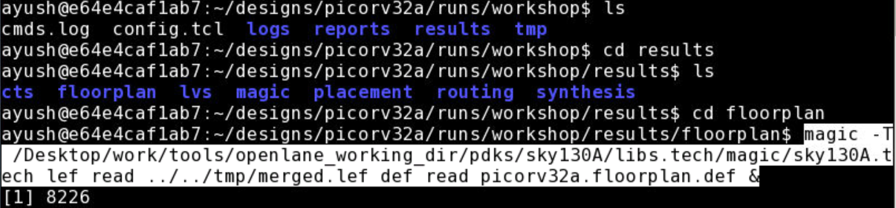

# Openlane_Workshop_VSD
This repository will reflect the work done in the Advanced Physical Design Flow workshop, offered by the folks at VSD. It's a 5 day workshop that aims to educate us on the intricacies of Open Source EDA tools and PDKs as used by industry leaders. Furthermore, it uses Openlane flow to help understand the flow of work when it comes to VLSI designs, starting from the RTL level to the GSDII stage, performing the synthesis, placement, floorplanning, routing and sta required to do so.

# Day 1 - An Introduction to OpenLANE

Day 1 kickstarted off with educating us about "chips". Most of us have played around with an Arduino, as electronics enthusiasts and hobbyists, but we've only toyed around with the functionalities of the Arudino, not the brain of the processor itself. The very first lecture of this workshop opened our eyes to what exactly lies in front of us if we choose to this "VLSI" career road, a road that in recent times has been travelled by many. 

Macros, IPs, RISC-V and the software-to-hardware piepline were some of the topics hit upon.

$PDK_ROOT is the parent root directory under which we will find the Skywater PDK files that have been used. Access to 3 main sub-directories, namely, sky130A, skywater-pdk and open_pdks have been provided.

1. Skywater-pdk – Contains all the foundry provided PDK related files
2. Open_pdks – Contains scripts that are used to bridge the gap between closed-source and open-source PDK to EDA tool compatibility
3. Sky130A – The open-source compatible PDK files

Sky130A comes with 2 sub-directories - libs.ref & libs.tech. They can be accessed as follows:-

libs.ref - This contains the process specific files. The one we're concerned with is sky130_fd_sc_hd. This can be deconstructed as:-

1. sky130A - Process Name
2. fd - foundry name
3. sc - standard cell
4. hd - high density

libs.tech - This contains files specific to the tools we'll be using for the purpose of end-to-end VLSI deisgn flow.

The tools included are - klayout, magic, netgen, ngspice, openflow, qflow

### Calling upon OpenLANE ###

The command used to run the OpenLANE flow is `./flow.tcl`

This command is explicitly run in the docker, which should be installed along with the OpenLANE tools, pdks and other files. 

To run OpenLANE interactively, `./flow.tcl -interactive` , should do the trick.

Furthermore, OpenLANE requires different software dependencies to run it, which is provided to it by running the command - package require openalane 0.9

The Designs being run through OpenLANE flow are enlisted below, under the directory openLANE_flow/designs

For the duration of this workshop, and for this repository, we will be focussing on the "picorv32a" design.
The design heirarchy for picorv32a is listed below

1. The "src" folder contains verilog and sdc files
2. The "config.tcl" file is responsible for containing the various design specific configuration switches and parameters as used by the OpenLANE flow tools.

### Preparing the Design ###

The Keyword "prep" is used for preparing the design so that it's ready to be used effectively by the OpenLANE tools.

The command to do this is : `prep -design <design_name> `
  
  In our case, design_name = picorv32a
  
This serves another important purpose, which is to merge the cell LEF and technology LEF information.

1.The cell LEF works towards providing the user with information about the standard cells, it's area, i/p-o/p terminals, different layers etc.

2.The Tech LEF files contains layer definitons and a set of restricted design rules

During this preparation stage of OpenLANE, the two LEF files are combined and are collectively termed as merge.LEF

### Running Synthesis ###

OpenLANE provides a very simple way to run the synthesis of the design file, (here picorv32a.v), interactively.

The command to do so is `%run_synthesis`, which takes about 2-4 minutes to run.

Here's a sneak peek into what your synthesis file picorv32a.synthesis.v (present in the designs/picorv32a/runs/<date_of_run>/results/synthesis folder) should look like

# Day 2 - Understanding Floorplanning and Standard Cells

### Additional Data Set-up features ###

The session started off with helping us understand the significance and application of the keywords _tag_ and _overwrite_

_tag_ is responsible for providing a convenient user defined name to the run we'll be executing. In my case, I've chosen to name the run "workshop" for the entire duration of the workshop.

This is implemented while preparing the design by executing this command :- `prep -design <design_name> -tag <tag_name> `

Here, design_name = picorv32a & tag_name = workshop

This reflects in the designs/picorv32a/runs folder as "workshop"

_overwrite_ is responsible for making & saving new changes in the configuration files (config.tcl) that are customized as per the user's convenience. However, this usually cleans everything preceding it, which is why there is emphasis laid on using the _set_ keyword for making changes.

`prep -design <design_name> -tag <tag_name> -overwrite` - used to overwrite new changes 

This is how one can use the _set_ keyword to make changes. Here it is demonstrated on the CLOCK_PERIOD variable.

### Running the floorplan tool ###

Running floorplan in OpenLANE is fairly simple :- `%run_floorplan` in the docker. 

In compatability with the other stages in the physical design flow, floorplan will also run as per the configuration settings preset in the design config.tcl files.

Once floorplan is run, it produces a def file "picorv32a.floorplan.def", which provides us with information about core area, as well as placement of standardized cell SITES.

`UNITS DISTANCE MICRONS 1000;` indicates that there exists 1000 data units in the space of 1 Micron.

`DIEAREA (0 0) (1057235 806405)` indicates the placement of the die. The two coordinates described follow the `(lower_left_x, lower_left,y) (upper_right_x upper_right_y)` system.

### Viewing Floorplan in Magic ###

We have taken the help of the Magic VLSI tool for the purpose of viewing the results of our floorplan.

For doing so, we must provide 3 main files:

1. Magic Technology file (sky130A.tech)
2. Floorplan's generated def file - picorv32a.floorplan.def
3. Merged LEF file from the preparation stage - merged.lef (found in the <tag_name>/tmp directory)

Another important point to note is that to view a certain tool's result in magic, the command must be run in the _"<tag_name>/results/<tool_name>"_ directory.

The command to view the result in magic is as follows:-

`magic -T /Desktop/work/tools/openlane_working_dir/pdks/sky130A/libs.tech/magic/sky130A.tech lef read ../../tmp/merged.lef def read picorv32a.floorplan.def &`

This opens up Magic, and we can view the basic floorplan laid out as :-

